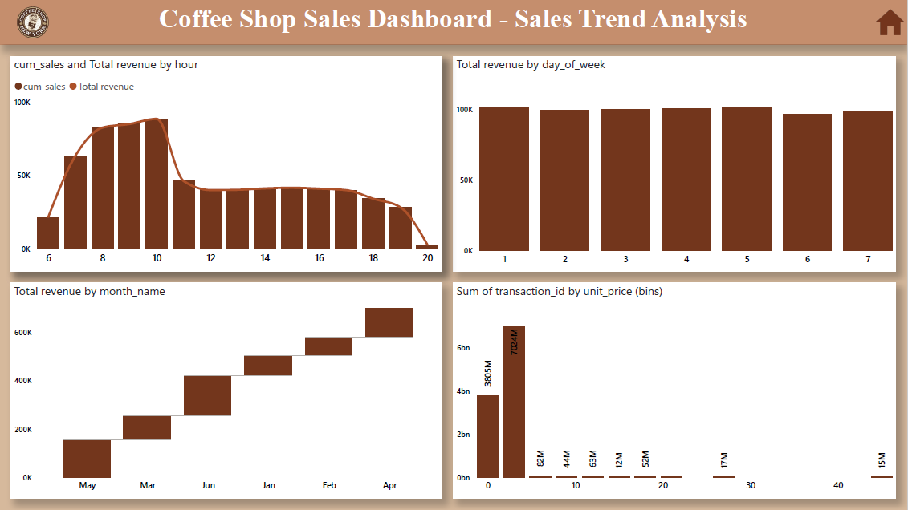

# Coffee shop analysis
## Project Summary 
The Coffee Shop Sales Analysis project focuses on understanding overall business performance by analyzing transactional sales data across multiple store locations and product categories. The objective of this project is to provide actionable insights that can help management improve revenue, optimize product offerings, and enhance operational efficiency.

Store performance analysis compared revenue and transaction volumes across different locations, highlighting which stores contribute the most to overall sales. This helps in understanding location-based performance differences and identifying opportunities for improvement. Product category analysis further broke down sales by category and product type, showing that coffee products dominate revenue, while bakery and tea products contribute significantly through volume sales.

The project emphasizes clarity and business relevance rather than complex modeling, making it easy for non-technical stakeholders to understand. Overall, this project demonstrates the ability to clean, analyze, and visualize data effectively while translating numbers into meaningful business insights. It serves as a strong foundational business intelligence project suitable for portfolio presentation and entry-level to early-intermediate data analyst roles.

[Click here to view Live Dashboard](https://app.powerbi.com/reportEmbed?reportId=a558396f-0970-49fa-b889-64b0e3903290&autoAuth=true&ctid=3ffff7b6-7ef4-4fa4-8fea-798ab0455714)
## Table of Content

1. [About the Company](#about-the-company)
2. [Client Requirement and Objective](#client-requirement-and-objective)
3. [Primary Goals of the Analysis](#primary-goals-of-the-analysis)
4. [Datasets Used for the Project](#datasets-used-for-the-project)
5. [Tools and Techniques Used](#tools-and-techniques-used)
6. [Sales Analysis](#sales-analysis)
7. [Product Analysis](#product-analysis)
8. [Demand Analysis](#demand-analysis)
9. [Conclusion](#conclusion)

## About the Company
The Coffee Shop is a multi-location retail café operating across several store locations, including Hell’s Kitchen, Astoria, and Lower Manhattan. The business offers a wide range of products such as coffee, tea, bakery items, drinking chocolate, and packaged goods. The dataset captures detailed transactional sales data, enabling analysis of sales trends, store performance, and customer demand patterns.

## Client Requirement and Objective
The management team wanted a clear understanding of overall sales performance, store-wise contribution, and product-level demand. The objective of this analysis was to evaluate revenue trends, identify high-performing stores and products, and understand customer purchasing behaviour across time. The insights are intended to support better decision-making in sales planning, inventory management, and product strategy.

[Home](#table-of-content)

## Primary Goals of the Analysis
- Analyse overall sales and revenue trends over time
- Identify top-performing and underperforming store locations
- Understand product category and product-type contribution to revenue
- Examine demand patterns by day, hour, and month

## Datasets Used for the Project
This project is based on coffee shop transactional sales data covering multiple months of operations. The following datasets were used:
Sales Dataset
-	Contains transaction-level data such as transaction ID, date, time, store location, quantity sold, and unit price.
Products Dataset
-	Includes product details such as product category, product type, and product name.
Calendar Dataset
-	Provides time-based attributes including day of week, month, and hour to support trend and demand analysis.
These datasets together support sales trend analysis, store performance comparison, and demand behaviour assessment.

[Home](#table-of-content)

## Tools and Techniques Used
### Tools
-	Microsoft Excel
-	Used for initial data review and basic validation
-	Checked data consistency and structure before visualization
### Power BI
-	Created interactive dashboards with slicers and filters
-	Built calculated measures using DAX
 - Designed business-focused and easy-to-read visualizations

## Techniques
-	Data Preparation: Cleaning and organizing transactional data
-	Data Modelling: Creating relationships between sales, products, and calendar tables
-	DAX Measures: Calculating KPIs such as total revenue, average transaction value, and total quantity sold
-	Data Visualization: Using charts, KPIs, and tables to communicate insights clearly

[Home](#table-of-content)

## Overview

[Home](#table-of-content)

## Sales Analysis
The Sales Analysis dashboard provides a high-level overview of business performance. It focuses on total revenue, transaction volume, and sales trends across months, days, and hours.

### Key Insights 
-	Sales revenue shows noticeable monthly variation, with stronger performance during mid-year months.
-	Transaction activity peaks during morning to early afternoon hours, indicating higher customer demand during breakfast and lunch periods.
-	Revenue trends closely follow transaction volume, suggesting stable pricing and consistent product mix.
-	Weekday sales remain relatively balanced, with minor fluctuations across days.

[Home](#table-of-content)

## Product Analysis
The Product Analysis dashboard evaluates how different product categories and product types contribute to overall sales and revenue.

### Key Insights 
-	Coffee is the highest revenue-generating category, followed by tea and bakery items.
-	Certain product types such as gourmet brewed coffee and espresso-based drinks drive a large share of total transactions.
-	Some products sell in high volume but at lower prices, while others generate higher revenue with fewer units sold.
-	A small number of products contribute significantly to total revenue, indicating product dependency.

[Home](#table-of-content)

## Demand Analysis
The Demand Analysis dashboard focuses on understanding customer purchasing behaviour across time, including daily, hourly, and monthly demand patterns.

### Key Insights 
-	Demand is time-dependent, with clear peaks during specific hours of the day.
-	Monthly demand varies, showing periods of higher customer activity and slower sales months.
-	Certain product categories experience more consistent demand, while others fluctuate more significantly.	
-	A large portion of daily sales occurs within limited peak hours, increasing operational dependency on these time windows.

[Home](#table-of-content)

## Conclusion
The Coffee Shop Sales Analysis provides a comprehensive view of sales performance, product contribution, and demand behaviour across multiple store locations. The analysis reveals that revenue is driven primarily by coffee products, peak sales occur during specific hours of the day, and some store locations consistently outperform others. While overall performance is stable, the business shows dependency on a limited set of products and peak demand periods. These insights highlight opportunities to optimize staffing, improve inventory planning, refine product offerings, and enhance sales strategies. Overall, this project demonstrates strong foundational business intelligence skills and serves as a solid portfolio project for data analytics roles.

[Home](#table-of-content)

